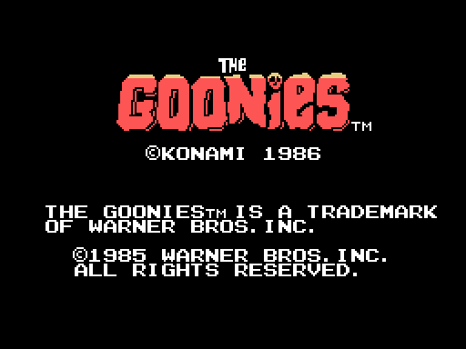
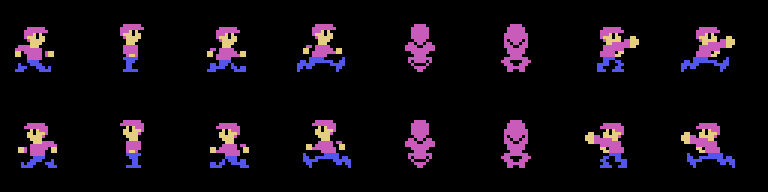
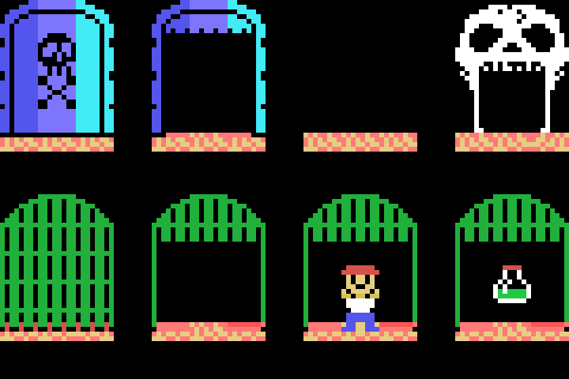
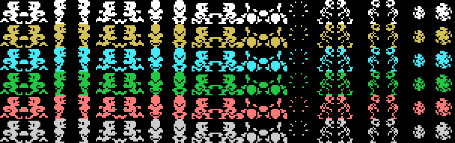
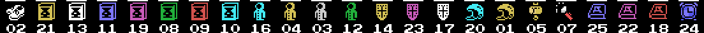

# The game

*The title screen, drawn from the ROM. The caption reads **© KONAMI 1986**, with
the 1985 Warner Bros. trademark notice below.*

Mikey goes down into the Astoria caves to rescue the other seven Goonies and
find One-Eyed Willy's treasure. There are **twenty-five levels across five
rounds of five**, and each level is **four rooms** of 32x20 tiles.

## What you do in a level

Get your friends out of their cages. Each one freed bumps the counter at
`(0xE130)`, and **with seven the skull door opens** — the one that lets you
through to the next level. The key is `(0xE121)`.

You move between rooms by walking off the sides. The link is not geometric: it
is **two twin tables of 19 rows by 4 columns** (`0x52DB` and `0x5327`), and
which one gets consulted depends on which side you leave by — the left one if
the column drops below `0x15`, the right one if it reaches `0xC0`. The row is
picked by the level's *room layout*, one of the 25 bytes at `0x9D67`.

## The player

Six states — walk, jump, ladder, fall, kick and mid-air kick — and sixteen
poses. Each pose is **three overlapping 16x16 sprites**, assembled by `0x586A`
from a nine-byte entry: y offset, x offset and pattern number, three times
over.

Speed carries a fraction: `0x0110` normally — one and one sixteenth pixels per
frame — and `0x0180` with item 0, which is one and a half.

## The green ropes

You climb and descend them, and they are not decoration: **tile `0x41` is the
foot of a rope** and you go up by pressing up; **tile `0x53` is the head**, the
one hanging from a platform, and you go down by pressing down (`0x66E4`). The
creatures use exactly the same ones.

## The hazards

*The skull door — shut and open — the door to the next level, and the four
cages: shut, open, with the friend inside and with the item inside.*

Each level brings two lists. The **level list** sits right behind the eighty
bytes of the map and spreads things across the four rooms; the **four room
lists** hang off a per-level table. Both are read the same way (`0x8D64` and
`0x8E73`): a byte `0xF0+type` opens a run, its records follow, and `0xFF`
closes.

| type | LEVEL list | ROOM list |
|---|---|---|
| 0 | rising column | water jet |
| 1 | stalactite | boulder |
| 2 | **the chaser** | flame |
| 3 | the door to the next level | pipe leak |
| 4 | blinking pickup | the spot that drips |
| 5 | cage | skull |
| 6 | hidden item | bat |
| 7 | the skull door | the many-legged creature |

`0x7A9E` runs through the seven damaging hazards and leaves the bit in
`(ix+00Ah)`, which is also where the player's colour comes from: water jet
`0x01`, stalactite `0x02`, drip `0x04`, flame `0x08`, column `0x10`, leak
`0x20` and boulder `0x40`.

*The single-square sprite patterns, in the six colours the game uses. The
colour is not in the drawing: it lives in the attribute.*

## The inventory

*The twenty-three items, with the level each appears in underneath.*

Twenty-three items, and the bottom row shows up to twelve 2x2 icons. They live
in three places: `0xE176` one bit per item, `0xE180` which slot each occupies in
the row, and the table at `0x6F68` its icon.

And they are not trophies: **they are shields with charges**. The list at
`0x7D9B` says which item stops which hazard; carrying it, the hit spends a
charge of `(0xE150+item)` instead of taking energy, and when the charges run out
the item is lost.

The table at `0x5576` says which level each is in: twenty-three distinct values
between 0 and 24, and **5 and 14 are exactly the ones missing**. Levels 6 and 15
are the only two with no item.

## The password

At the end of each round, `0x53A7` shows you, under the `KEYWORD` caption, the
name of the round you have just cleared. That name *is* the password, because
they are **the same bytes**: MR SLOTH, GOON DOCKS, DOUBLOON, ONE EYED WILLY and
GOONIES. The whole story is in [Findings](FINDINGS.html).

## All one hundred rooms

They are drawn one by one in [The 25 levels](THE-LEVELS.html).
