# Las 100 salas

Aqui estan **las cien salas** del cartucho, una a una. Veinticinco niveles de
cuatro salas cada uno, y **ninguna se repite**: comparadas casilla a casilla
las cien, salen cien distintas. Todas dibujadas desde los bytes de la ROM, ni
una captura.

Cada sala son 32x20 casillas que salen de ochenta bytes apuntando a bloques de
8x4, se descomprimen, y encima se planta —en el sitio exacto en el que el
cartucho la planta— cada cosa de las dos listas del nivel: las jaulas, las
puertas, los peligros, los bichos y el objeto escondido.

Las **64.000 casillas** que salen de aqui caben en **2.983 bytes** del
cartucho. Como, esta contado en [El codigo](EL-CODIGO.html).

Debajo de cada sala va lo que lleva encima, contado recorriendo las listas con
las mismas reglas que usa el Z80. Los rotulos estan escritos con la fuente del
propio cartucho.

Y no van sueltas. Delante de cada nivel va **el plano entero**, con las cuatro
salas puestas donde el cartucho las pone: el reparto que le da `0x52DB`, que no
es el mismo en todos -hay columnas, filas, 2x2 y catorce formas raras-. Montadas
asi, las plataformas y las escaleras siguen de una sala a la de al lado.
Delante de cada ronda va ademas **el minimapa de sus cinco niveles**, con las
puertas de calavera unidas.

## Ronda 1 — niveles 1 a 5

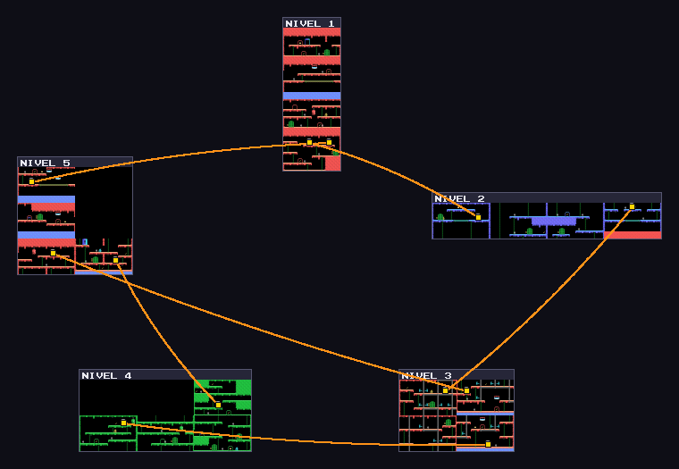

*Los cinco niveles de la ronda 1 y sus puertas de calavera. Cada nivel esta puesto con el reparto de salas que le da 0x52DB, y cada raya une DOS puertas que se emparejan de verdad: la puerta j del nivel A dice (B, k) y la puerta k del nivel B dice (A, j). Las 64 del cartucho emparejan asi, y ninguna sale de su ronda. Dos cosas de este dibujo NO salen de la ROM, y por eso se dicen: el sitio de cada nivel en el anillo -de los doce ordenes posibles se elige el que menos cruces deja- y la comba de las curvas, que separa las parejas de niveles unidas por DOS puertas.*

### Nivel 1

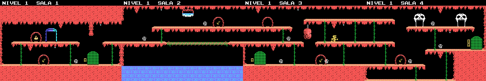

*Las cuatro salas del nivel 1, puestas donde el cartucho las pone: una columna de cuatro. El reparto sale del nibble alto de 0x52DB, que es columna por cuatro mas fila.*

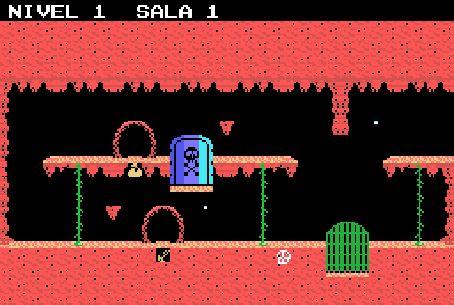

*Nivel 1, sala 1. Lleva: 2 estalactita, 2 gotera, 1 trasto, 1 jaula, 1 objeto, 1 puerta, 1 calavera.*

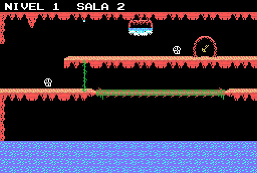

*Nivel 1, sala 2. Lleva: 2 calavera, 1 estalactita, 1 trasto, 1 agua, 1 gotera.*

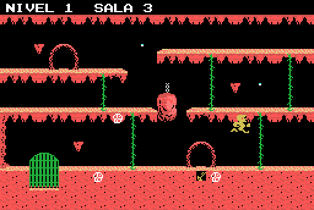

*Nivel 1, sala 3. Lleva: 3 estalactita, 3 calavera, 2 gotera, 1 perseguidor, 1 trasto, 1 jaula, 1 bola de piedra.*

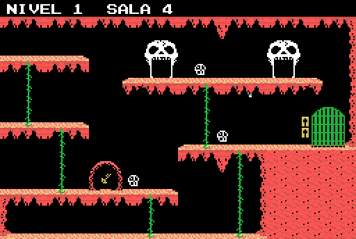

*Nivel 1, sala 4. Lleva: 3 calavera, 2 estalactita, 2 puerta al nivel, 1 trasto, 1 jaula, 1 gotera.*

### Nivel 2

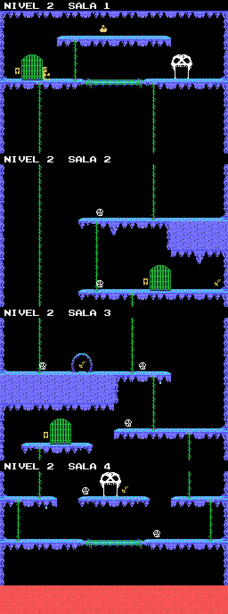

*Las cuatro salas del nivel 2, puestas donde el cartucho las pone: una fila de cuatro. El reparto sale del nibble alto de 0x52DB, que es columna por cuatro mas fila.*

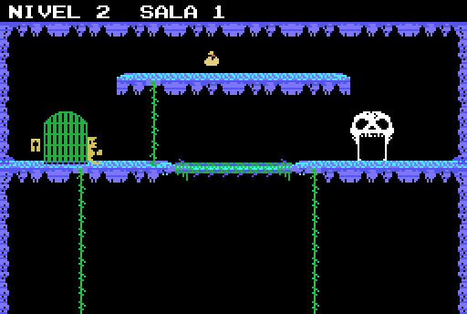

*Nivel 2, sala 1. Lleva: 1 perseguidor, 1 puerta al nivel, 1 jaula, 1 objeto.*

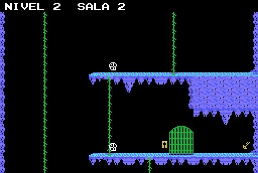

*Nivel 2, sala 2. Lleva: 2 estalactita, 2 calavera, 1 trasto, 1 jaula.*

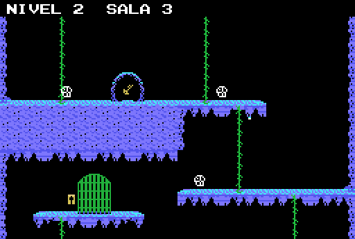

*Nivel 2, sala 3. Lleva: 3 calavera, 1 trasto, 1 jaula, 1 gotera.*

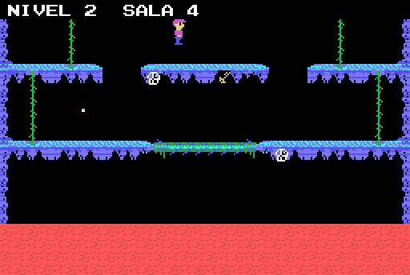

*Nivel 2, sala 4. Lleva: 2 calavera, 1 puerta al nivel, 1 trasto, 1 gotera.*

### Nivel 3

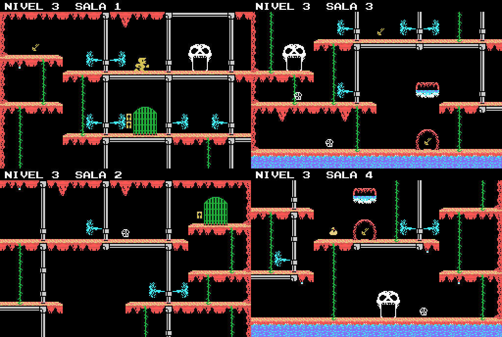

*Las cuatro salas del nivel 3, puestas donde el cartucho las pone: 2x2. El reparto sale del nibble alto de 0x52DB, que es columna por cuatro mas fila.*

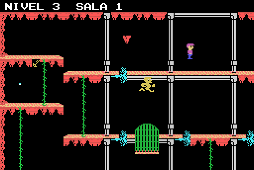

*Nivel 3, sala 1. Lleva: 6 chorro del tubo, 1 estalactita, 1 perseguidor, 1 puerta al nivel, 1 trasto, 1 jaula, 1 gotera.*

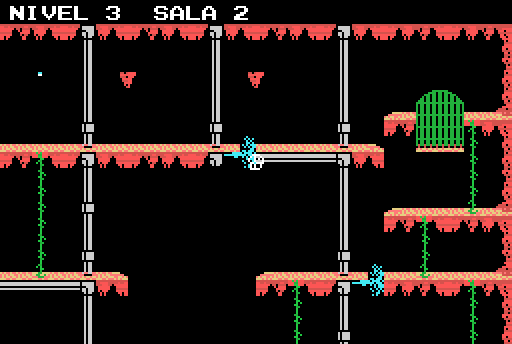

*Nivel 3, sala 2. Lleva: 3 chorro del tubo, 2 estalactita, 1 jaula, 1 gotera, 1 calavera.*

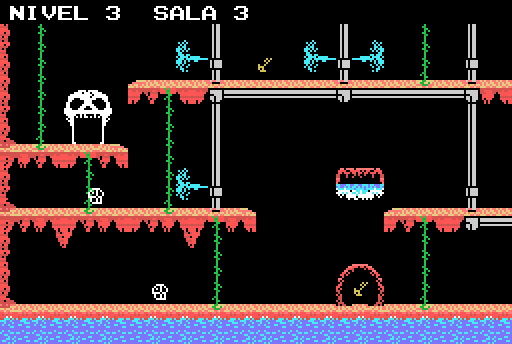

*Nivel 3, sala 3. Lleva: 4 chorro del tubo, 2 estalactita, 2 trasto, 2 calavera, 1 puerta al nivel, 1 agua.*

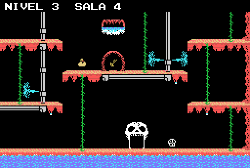

*Nivel 3, sala 4. Lleva: 3 chorro del tubo, 3 gotera, 1 puerta al nivel, 1 trasto, 1 objeto, 1 agua, 1 calavera.*

### Nivel 4

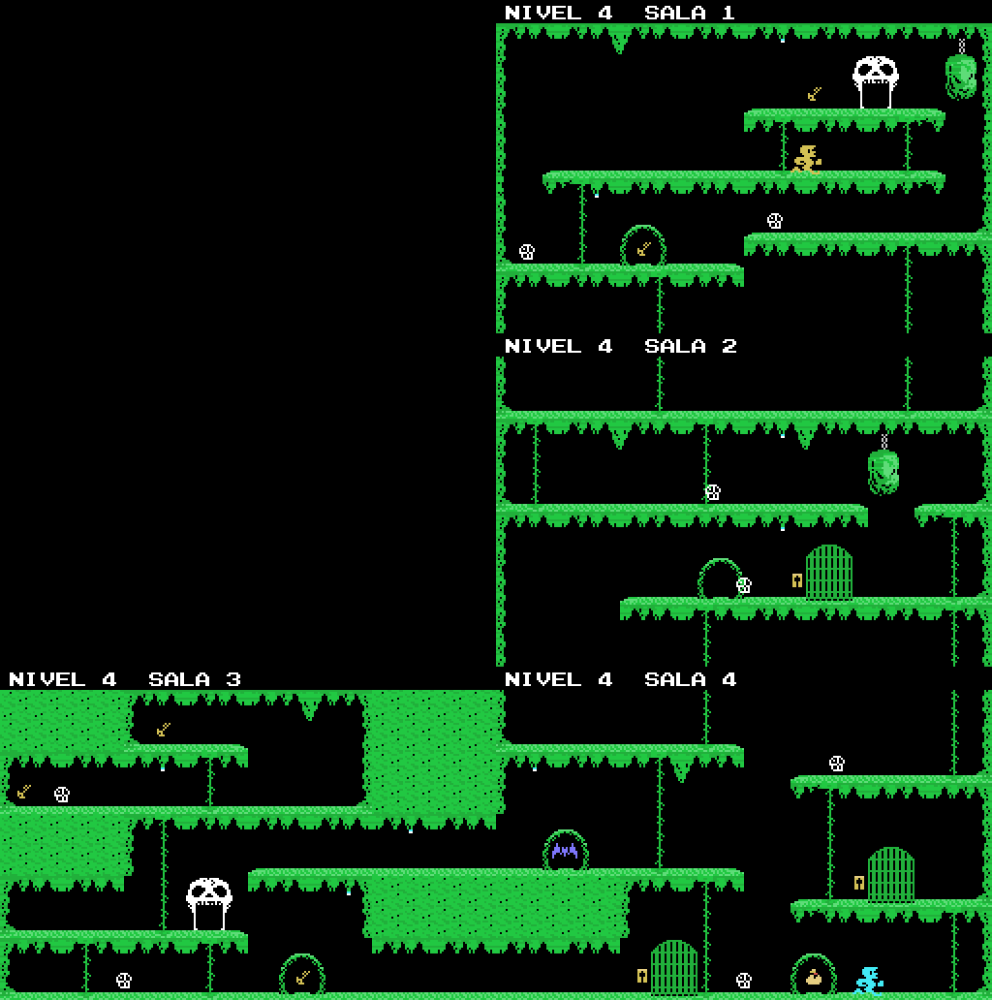

*Las cuatro salas del nivel 4, puestas donde el cartucho las pone: 3x2, `--3 / 124`. El reparto sale del nibble alto de 0x52DB, que es columna por cuatro mas fila.*

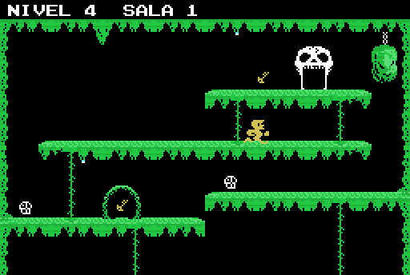

*Nivel 4, sala 1. Lleva: 2 trasto, 2 gotera, 2 calavera, 1 estalactita, 1 perseguidor, 1 puerta al nivel, 1 bola de piedra.*

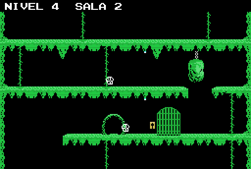

*Nivel 4, sala 2. Lleva: 2 estalactita, 2 gotera, 2 calavera, 1 jaula, 1 bola de piedra.*

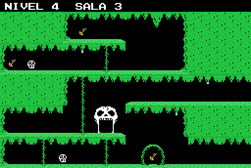

*Nivel 4, sala 3. Lleva: 3 trasto, 3 gotera, 2 calavera, 1 estalactita, 1 puerta al nivel.*

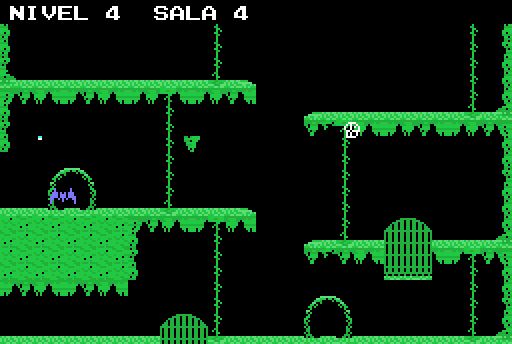

*Nivel 4, sala 4. Lleva: 2 jaula, 2 calavera, 1 estalactita, 1 perseguidor, 1 objeto, 1 gotera, 1 murcielago.*

### Nivel 5

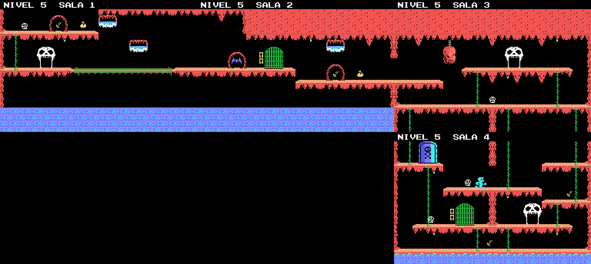

*Las cuatro salas del nivel 5, puestas donde el cartucho las pone: 2x3, `1- / 2- / 34`. El reparto sale del nibble alto de 0x52DB, que es columna por cuatro mas fila.*

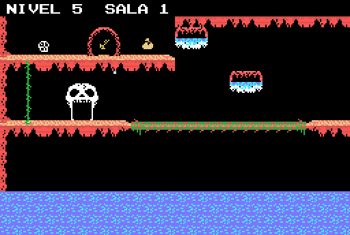

*Nivel 5, sala 1. Lleva: 2 agua, 1 puerta al nivel, 1 trasto, 1 objeto, 1 gotera, 1 calavera.*

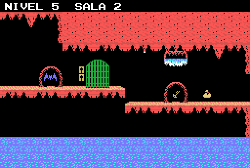

*Nivel 5, sala 2. Lleva: 2 estalactita, 1 trasto, 1 jaula, 1 objeto, 1 agua, 1 gotera, 1 murcielago.*

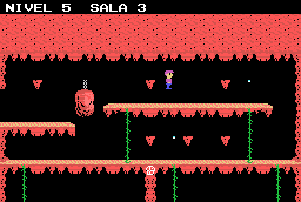

*Nivel 5, sala 3. Lleva: 6 estalactita, 2 gotera, 1 puerta al nivel, 1 bola de piedra, 1 calavera.*

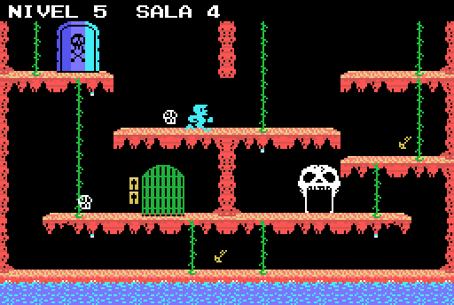

*Nivel 5, sala 4. Lleva: 4 gotera, 2 trasto, 2 calavera, 1 perseguidor, 1 puerta al nivel, 1 jaula, 1 puerta.*

## Ronda 2 — niveles 6 a 10

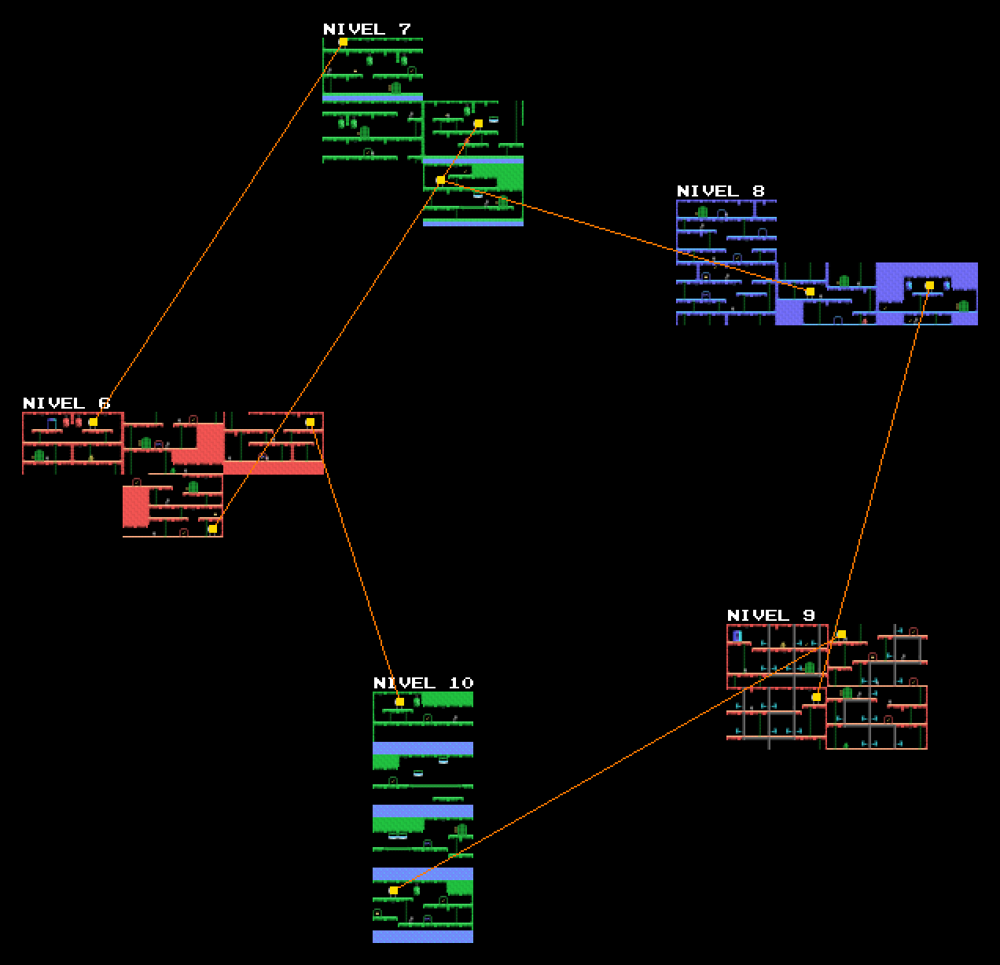

*Los cinco niveles de la ronda 2 y sus puertas de calavera. Cada nivel esta puesto con el reparto de salas que le da 0x52DB, y cada raya une DOS puertas que se emparejan de verdad: la puerta j del nivel A dice (B, k) y la puerta k del nivel B dice (A, j). Las 64 del cartucho emparejan asi, y ninguna sale de su ronda. Dos cosas de este dibujo NO salen de la ROM, y por eso se dicen: el sitio de cada nivel en el anillo -de los doce ordenes posibles se elige el que menos cruces deja- y la comba de las curvas, que separa las parejas de niveles unidas por DOS puertas.*

### Nivel 6

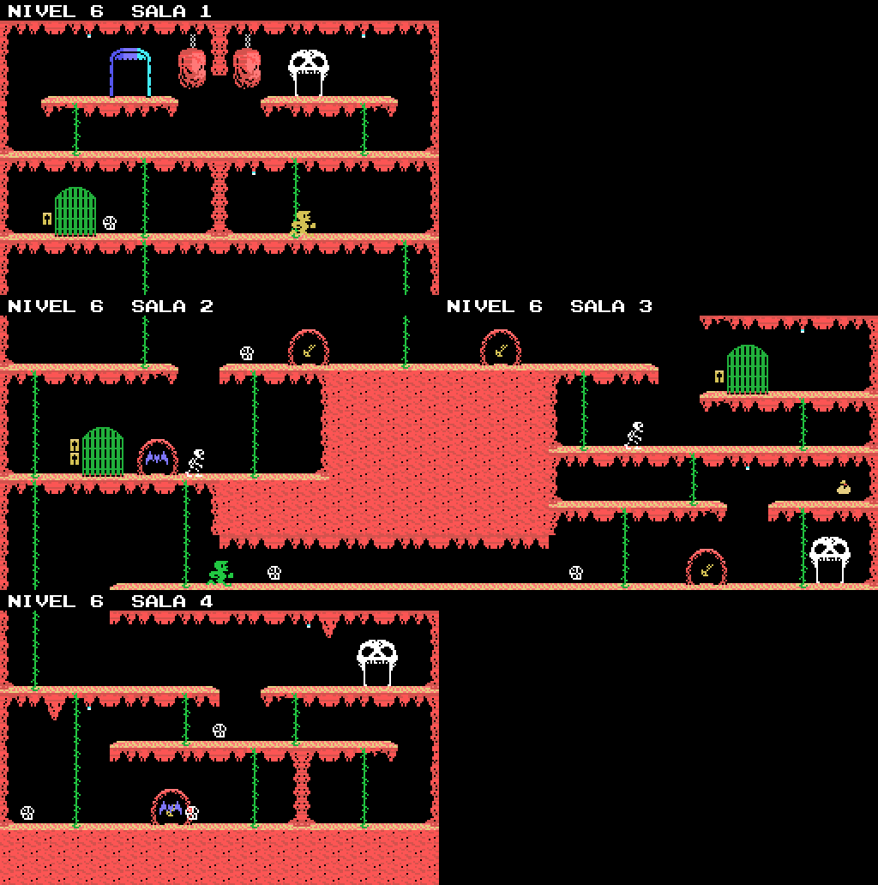

*Las cuatro salas del nivel 6, puestas donde el cartucho las pone: 3x2, `124 / -3-`. El reparto sale del nibble alto de 0x52DB, que es columna por cuatro mas fila.*

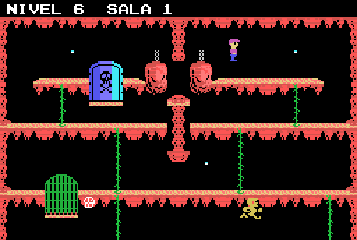

*Nivel 6, sala 1. Lleva: 6 columna que crece, 3 gotera, 2 bola de piedra, 1 perseguidor, 1 puerta al nivel, 1 jaula, 1 puerta, 1 calavera.*

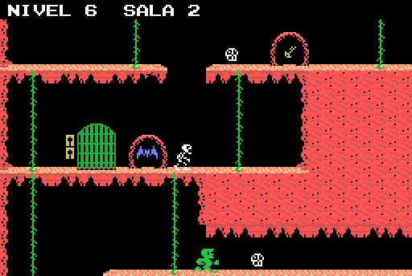

*Nivel 6, sala 2. Lleva: 2 perseguidor, 2 calavera, 1 trasto, 1 jaula, 1 murcielago.*

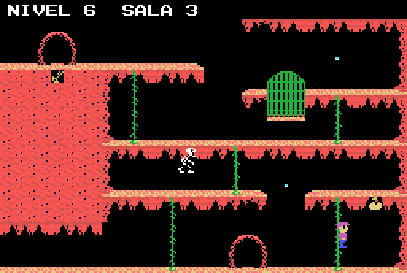

*Nivel 6, sala 3. Lleva: 2 trasto, 2 gotera, 1 perseguidor, 1 puerta al nivel, 1 jaula, 1 objeto, 1 calavera.*

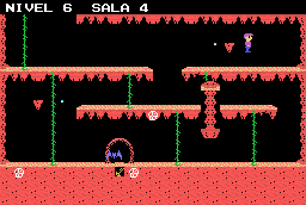

*Nivel 6, sala 4. Lleva: 6 columna que crece, 3 calavera, 2 estalactita, 2 gotera, 1 puerta al nivel, 1 trasto, 1 murcielago.*

### Nivel 7

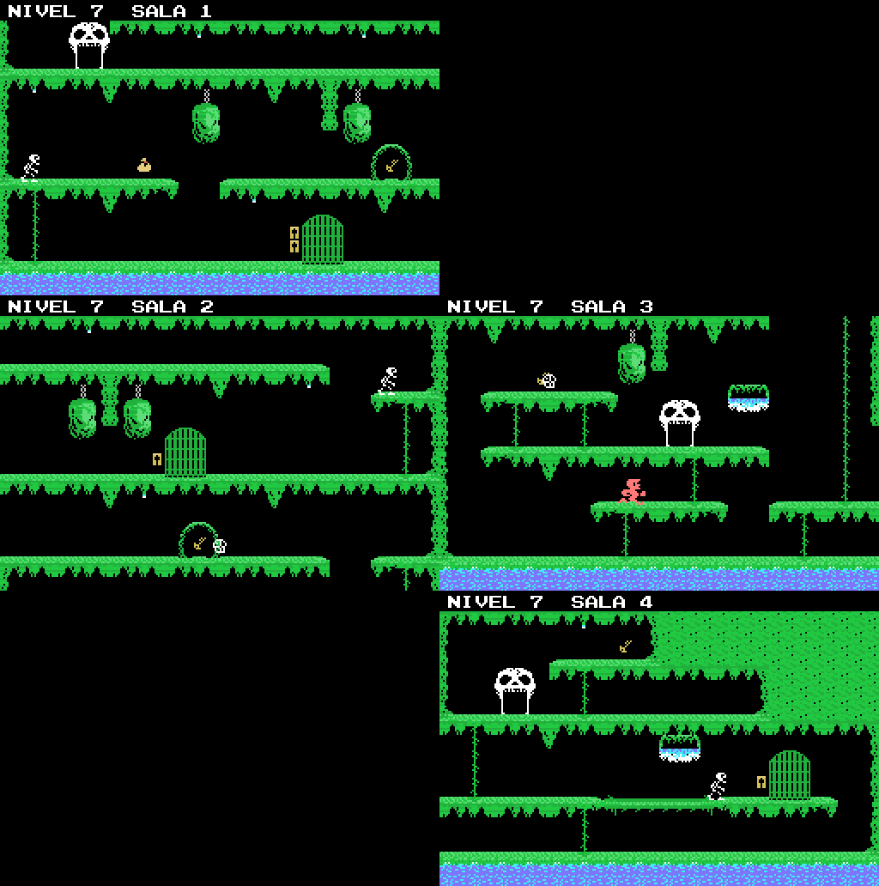

*Las cuatro salas del nivel 7, puestas donde el cartucho las pone: 2x3, `1- / 23 / -4`. El reparto sale del nibble alto de 0x52DB, que es columna por cuatro mas fila.*

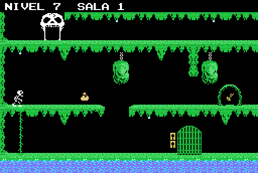

*Nivel 7, sala 1. Lleva: 4 estalactita, 4 gotera, 2 bola de piedra, 1 perseguidor, 1 puerta al nivel, 1 trasto, 1 jaula, 1 objeto.*

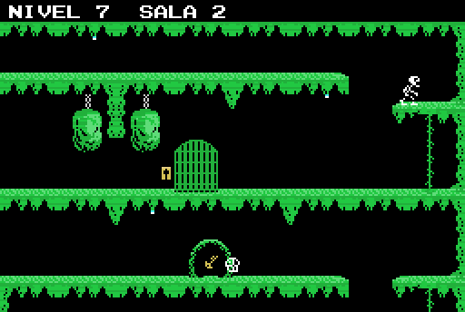

*Nivel 7, sala 2. Lleva: 3 estalactita, 3 gotera, 2 bola de piedra, 1 perseguidor, 1 trasto, 1 jaula, 1 calavera.*

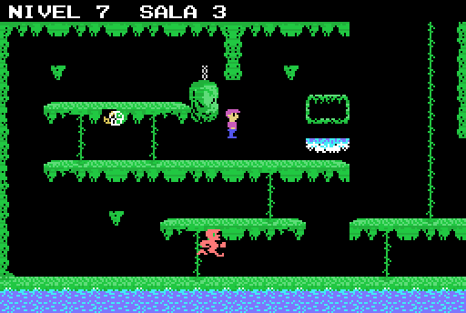

*Nivel 7, sala 3. Lleva: 3 estalactita, 1 perseguidor, 1 puerta al nivel, 1 trasto, 1 agua, 1 bola de piedra, 1 calavera.*

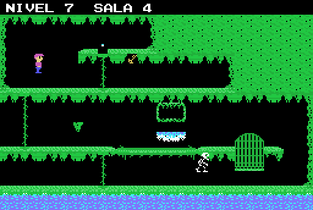

*Nivel 7, sala 4. Lleva: 1 estalactita, 1 perseguidor, 1 puerta al nivel, 1 trasto, 1 jaula, 1 agua, 1 gotera.*

### Nivel 8

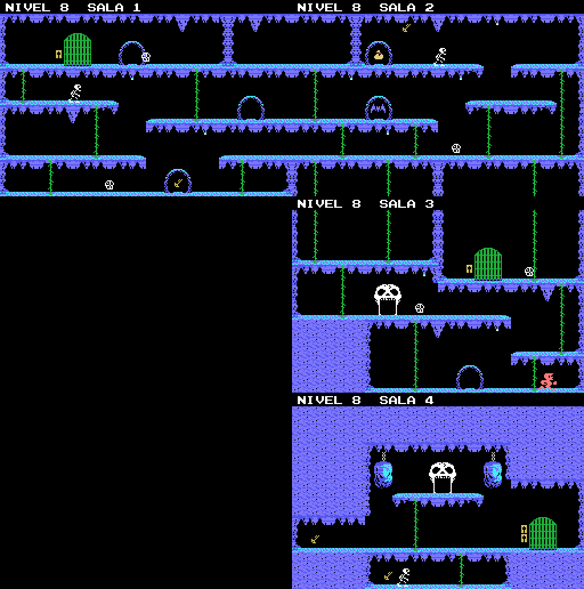

*Las cuatro salas del nivel 8, puestas donde el cartucho las pone: 3x2, `1-- / 234`. El reparto sale del nibble alto de 0x52DB, que es columna por cuatro mas fila.*

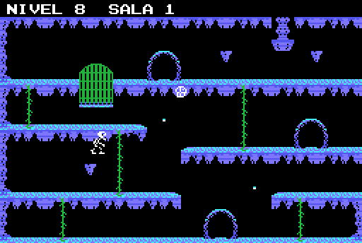

*Nivel 8, sala 1. Lleva: 6 columna que crece, 3 estalactita, 2 gotera, 2 calavera, 1 perseguidor, 1 trasto, 1 jaula.*

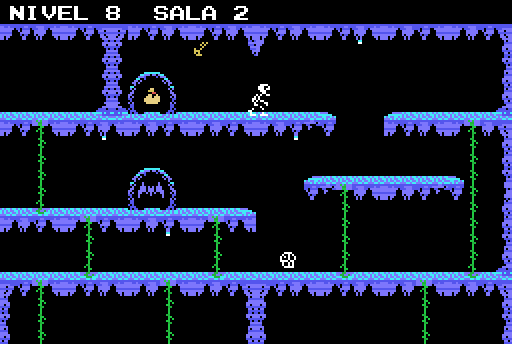

*Nivel 8, sala 2. Lleva: 6 columna que crece, 4 gotera, 1 estalactita, 1 perseguidor, 1 trasto, 1 objeto, 1 calavera, 1 murcielago.*

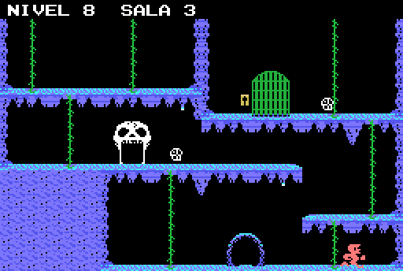

*Nivel 8, sala 3. Lleva: 2 estalactita, 2 gotera, 2 calavera, 1 perseguidor, 1 puerta al nivel, 1 jaula.*

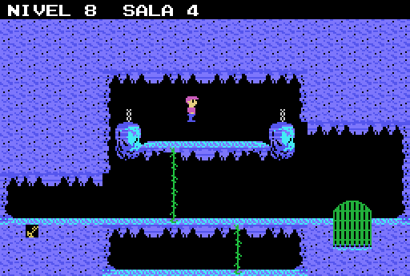

*Nivel 8, sala 4. Lleva: 2 trasto, 2 bola de piedra, 1 perseguidor, 1 puerta al nivel, 1 jaula.*

### Nivel 9

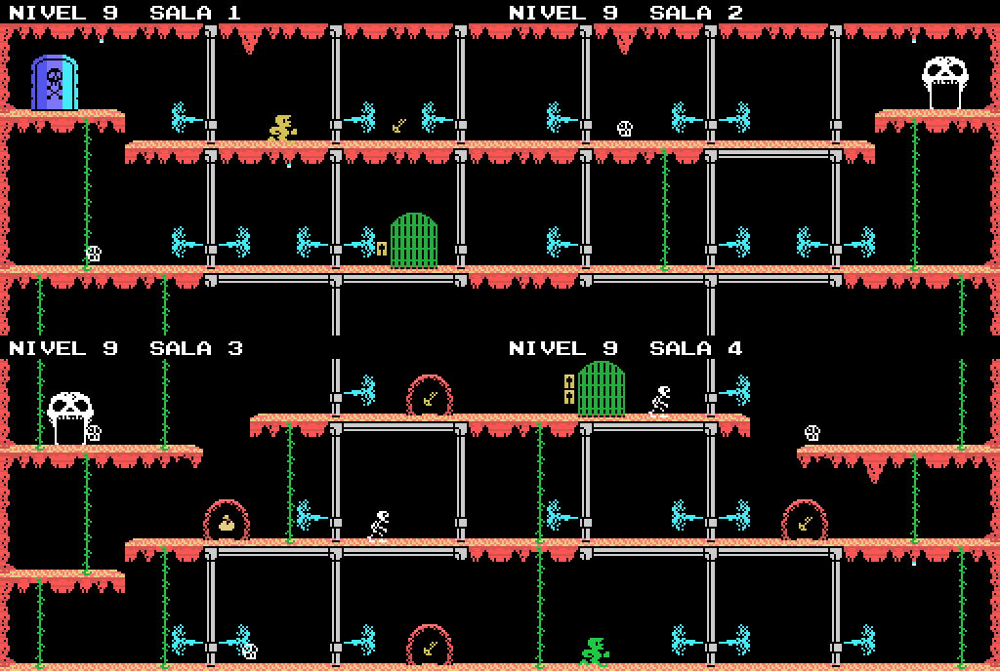

*Las cuatro salas del nivel 9, puestas donde el cartucho las pone: 2x2. El reparto sale del nibble alto de 0x52DB, que es columna por cuatro mas fila.*

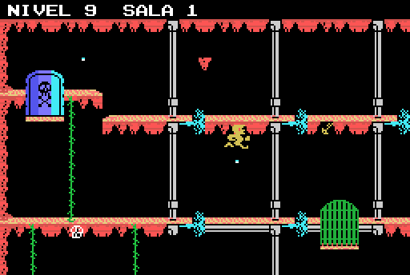

*Nivel 9, sala 1. Lleva: 7 chorro del tubo, 2 gotera, 1 estalactita, 1 perseguidor, 1 trasto, 1 jaula, 1 puerta, 1 calavera.*

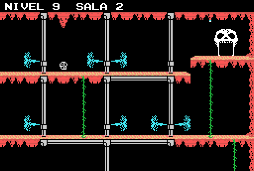

*Nivel 9, sala 2. Lleva: 7 chorro del tubo, 1 estalactita, 1 puerta al nivel, 1 gotera, 1 calavera.*

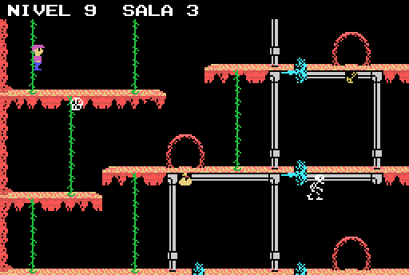

*Nivel 9, sala 3. Lleva: 5 chorro del tubo, 2 trasto, 2 calavera, 1 perseguidor, 1 puerta al nivel, 1 objeto.*

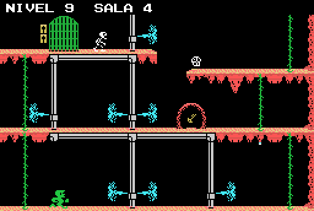

*Nivel 9, sala 4. Lleva: 7 chorro del tubo, 2 perseguidor, 1 estalactita, 1 trasto, 1 jaula, 1 gotera, 1 calavera.*

### Nivel 10

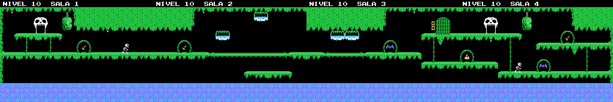

*Las cuatro salas del nivel 10, puestas donde el cartucho las pone: una columna de cuatro. El reparto sale del nibble alto de 0x52DB, que es columna por cuatro mas fila.*

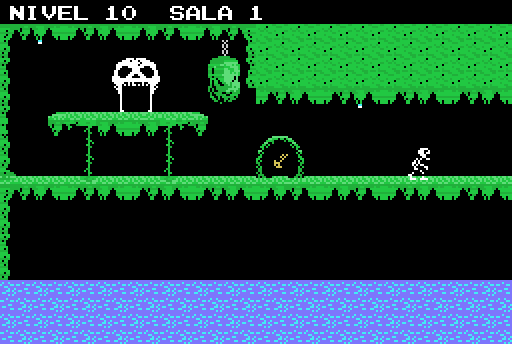

*Nivel 10, sala 1. Lleva: 2 gotera, 1 perseguidor, 1 puerta al nivel, 1 trasto, 1 bola de piedra.*

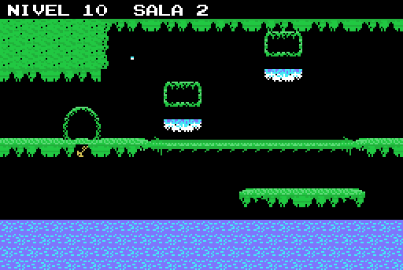

*Nivel 10, sala 2. Lleva: 2 agua, 1 trasto, 1 gotera.*

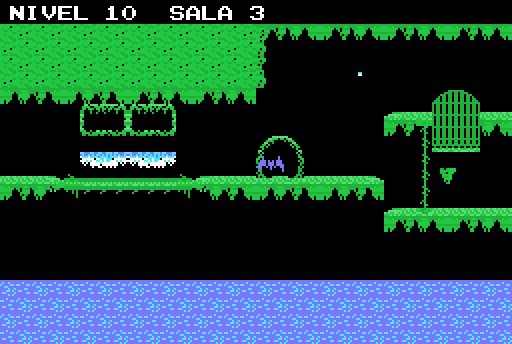

*Nivel 10, sala 3. Lleva: 2 agua, 1 estalactita, 1 jaula, 1 gotera, 1 murcielago.*

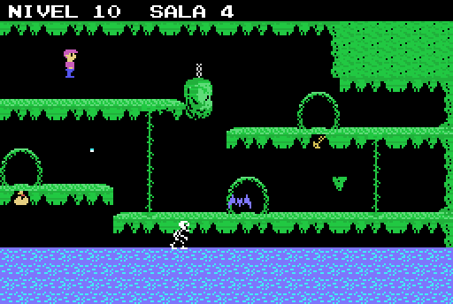

*Nivel 10, sala 4. Lleva: 1 estalactita, 1 perseguidor, 1 puerta al nivel, 1 trasto, 1 objeto, 1 bola de piedra, 1 gotera, 1 murcielago.*

## Ronda 3 — niveles 11 a 15

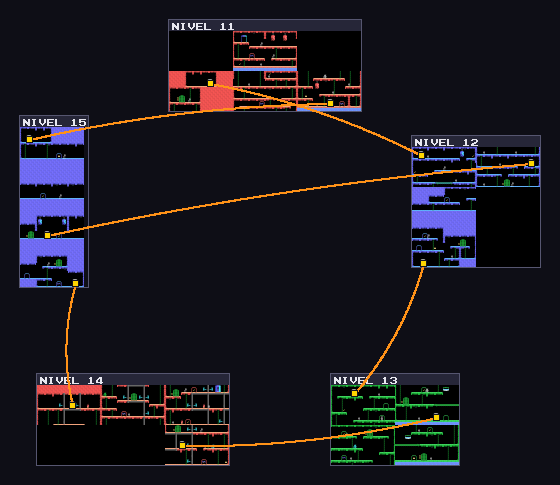

*Los cinco niveles de la ronda 3 y sus puertas de calavera. Cada nivel esta puesto con el reparto de salas que le da 0x52DB, y cada raya une DOS puertas que se emparejan de verdad: la puerta j del nivel A dice (B, k) y la puerta k del nivel B dice (A, j). Las 64 del cartucho emparejan asi, y ninguna sale de su ronda. Dos cosas de este dibujo NO salen de la ROM, y por eso se dicen: el sitio de cada nivel en el anillo -de los doce ordenes posibles se elige el que menos cruces deja- y la comba de las curvas, que separa las parejas de niveles unidas por DOS puertas.*

### Nivel 11

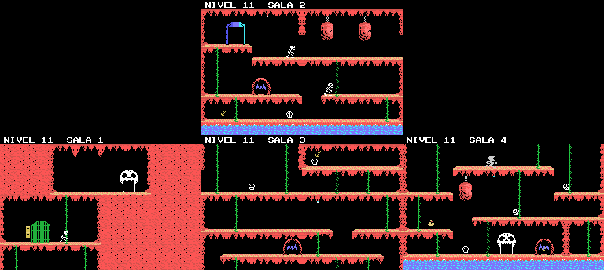

*Las cuatro salas del nivel 11, puestas donde el cartucho las pone: 3x2, `-2- / 134`. El reparto sale del nibble alto de 0x52DB, que es columna por cuatro mas fila.*

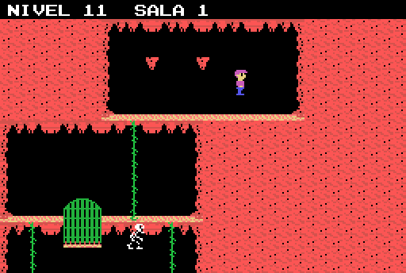

*Nivel 11, sala 1. Lleva: 2 estalactita, 1 perseguidor, 1 puerta al nivel, 1 jaula.*

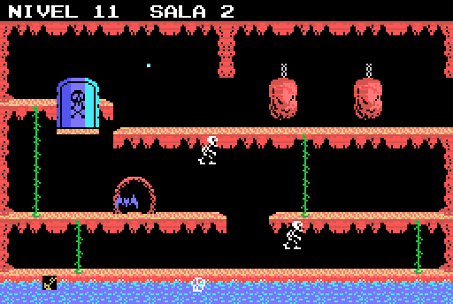

*Nivel 11, sala 2. Lleva: 2 perseguidor, 2 bola de piedra, 1 trasto, 1 puerta, 1 gotera, 1 calavera, 1 murcielago.*

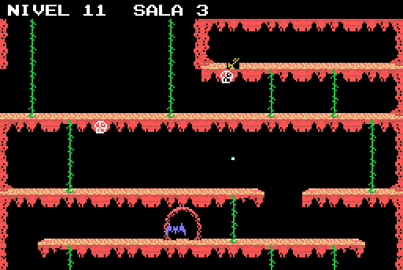

*Nivel 11, sala 3. Lleva: 2 calavera, 1 trasto, 1 gotera, 1 murcielago.*

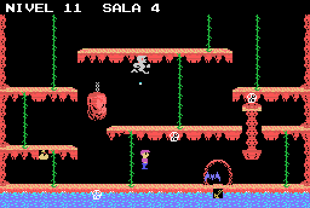

*Nivel 11, sala 4. Lleva: 6 columna que crece, 3 calavera, 1 perseguidor, 1 puerta al nivel, 1 trasto, 1 objeto, 1 bola de piedra, 1 gotera, 1 murcielago.*

### Nivel 12

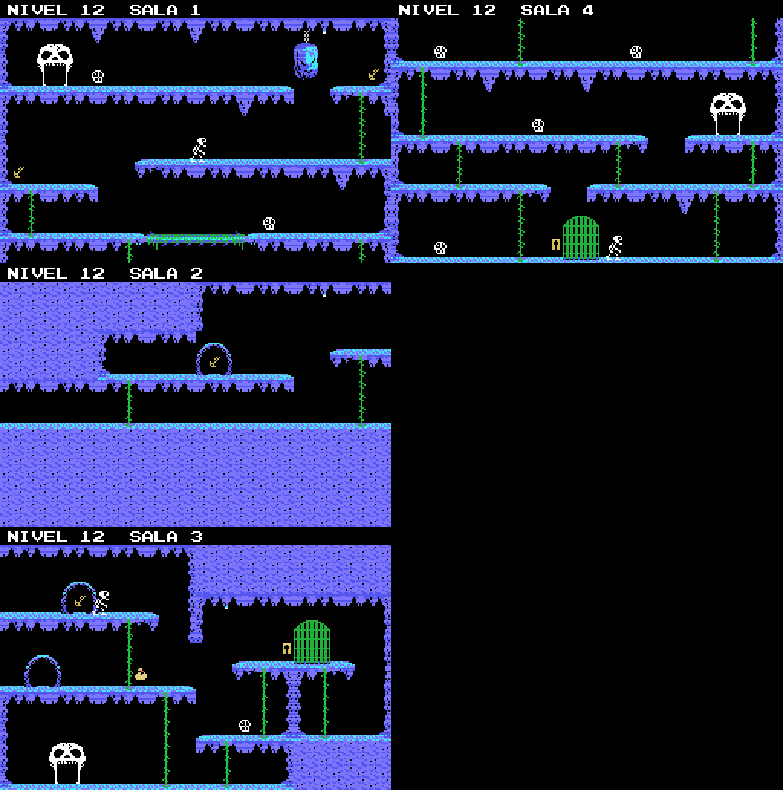

*Las cuatro salas del nivel 12, puestas donde el cartucho las pone: 2x3, `14 / 2- / 3-`. El reparto sale del nibble alto de 0x52DB, que es columna por cuatro mas fila.*

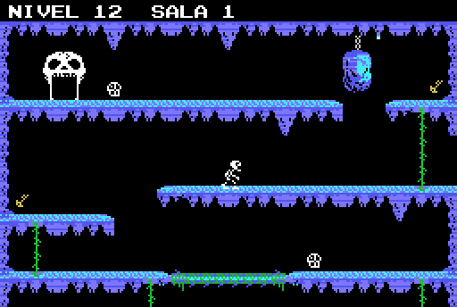

*Nivel 12, sala 1. Lleva: 4 estalactita, 2 trasto, 2 calavera, 1 perseguidor, 1 puerta al nivel, 1 bola de piedra, 1 gotera.*

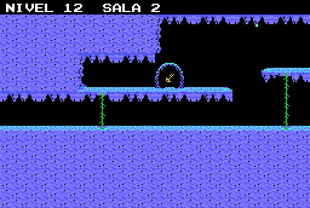

*Nivel 12, sala 2. Lleva: 1 trasto, 1 gotera.*

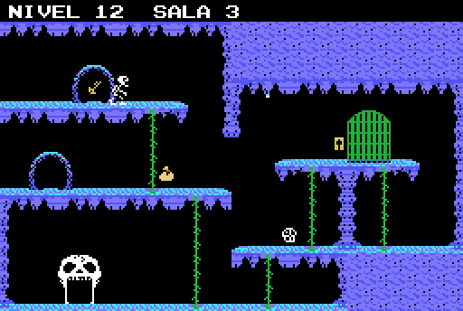

*Nivel 12, sala 3. Lleva: 6 columna que crece, 1 perseguidor, 1 puerta al nivel, 1 trasto, 1 jaula, 1 objeto, 1 gotera, 1 calavera.*

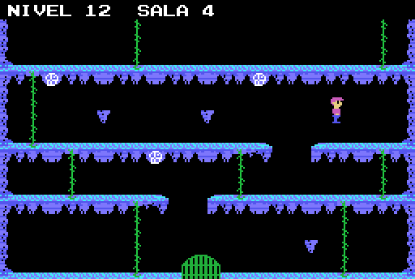

*Nivel 12, sala 4. Lleva: 4 calavera, 3 estalactita, 1 perseguidor, 1 puerta al nivel, 1 jaula.*

### Nivel 13

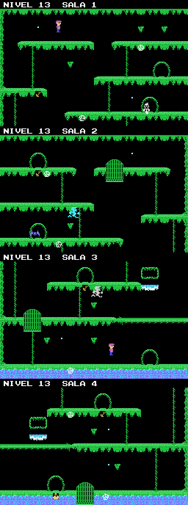

*Las cuatro salas del nivel 13, puestas donde el cartucho las pone: 2x2. El reparto sale del nibble alto de 0x52DB, que es columna por cuatro mas fila.*

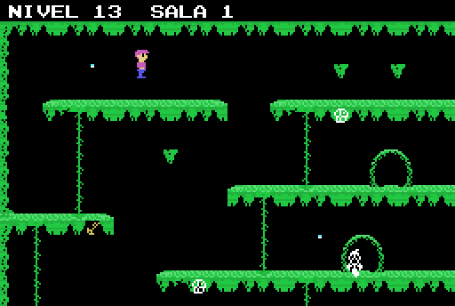

*Nivel 13, sala 1. Lleva: 3 estalactita, 2 gotera, 2 calavera, 1 puerta al nivel, 1 trasto, 1 bicho de patas.*

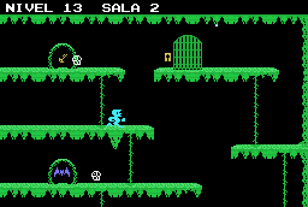

*Nivel 13, sala 2. Lleva: 2 calavera, 1 estalactita, 1 perseguidor, 1 trasto, 1 jaula, 1 gotera, 1 murcielago.*

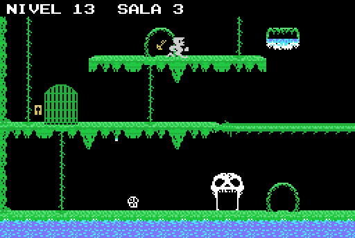

*Nivel 13, sala 3. Lleva: 3 estalactita, 1 perseguidor, 1 puerta al nivel, 1 trasto, 1 jaula, 1 agua, 1 gotera, 1 calavera.*

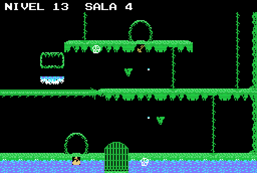

*Nivel 13, sala 4. Lleva: 2 estalactita, 2 gotera, 2 calavera, 1 trasto, 1 jaula, 1 objeto, 1 agua.*

### Nivel 14

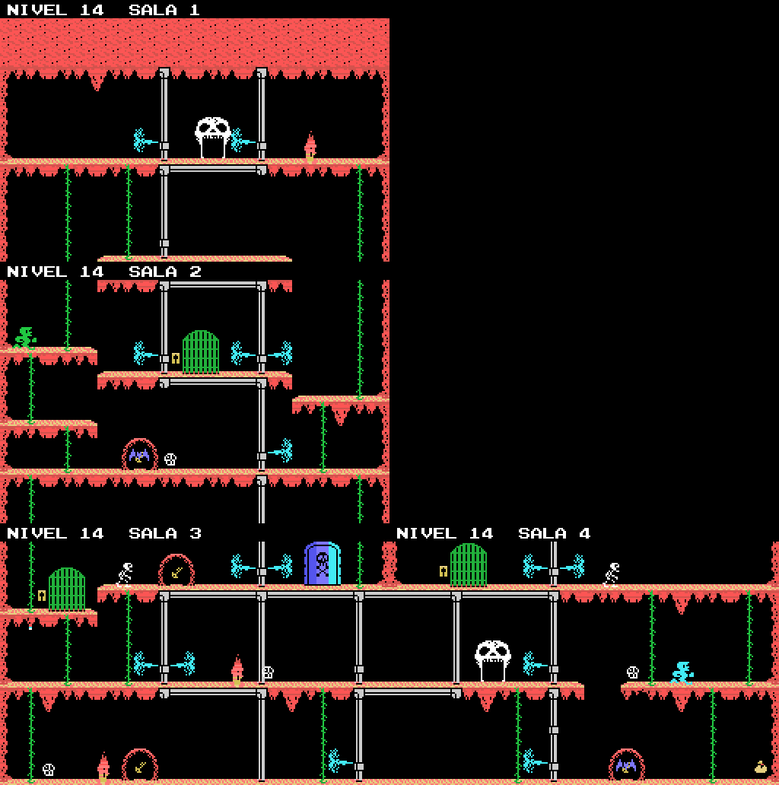

*Las cuatro salas del nivel 14, puestas donde el cartucho las pone: 3x2, `123 / --4`. El reparto sale del nibble alto de 0x52DB, que es columna por cuatro mas fila.*

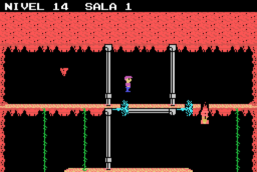

*Nivel 14, sala 1. Lleva: 2 chorro del tubo, 1 estalactita, 1 puerta al nivel, 1 llamarada.*

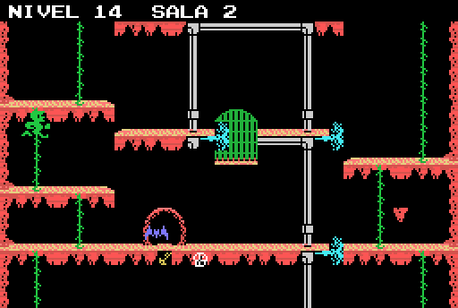

*Nivel 14, sala 2. Lleva: 4 chorro del tubo, 1 estalactita, 1 perseguidor, 1 trasto, 1 jaula, 1 calavera, 1 murcielago.*

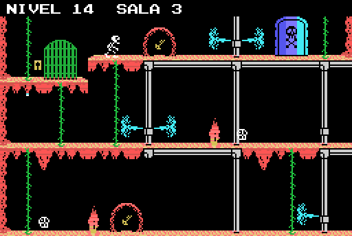

*Nivel 14, sala 3. Lleva: 5 chorro del tubo, 2 estalactita, 2 trasto, 2 llamarada, 2 calavera, 1 perseguidor, 1 jaula, 1 puerta, 1 gotera.*

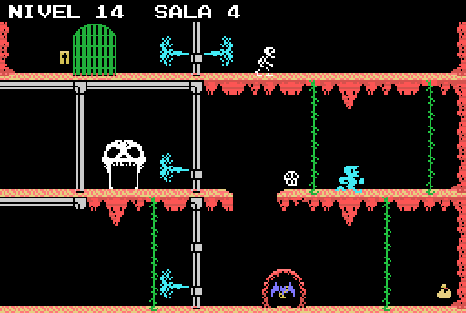

*Nivel 14, sala 4. Lleva: 4 chorro del tubo, 3 estalactita, 2 perseguidor, 1 puerta al nivel, 1 trasto, 1 jaula, 1 objeto, 1 calavera, 1 murcielago.*

### Nivel 15

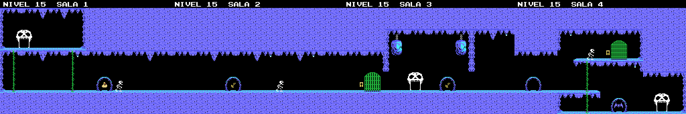

*Las cuatro salas del nivel 15, puestas donde el cartucho las pone: una columna de cuatro. El reparto sale del nibble alto de 0x52DB, que es columna por cuatro mas fila.*

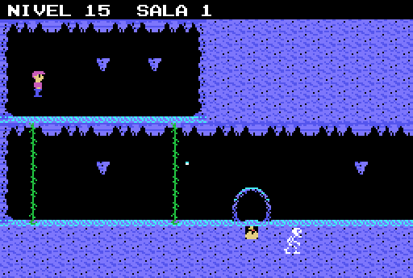

*Nivel 15, sala 1. Lleva: 4 estalactita, 1 perseguidor, 1 puerta al nivel, 1 objeto, 1 gotera.*

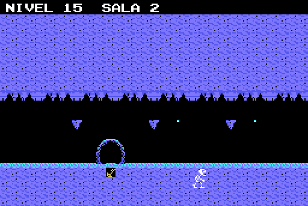

*Nivel 15, sala 2. Lleva: 3 estalactita, 2 gotera, 1 perseguidor, 1 trasto.*

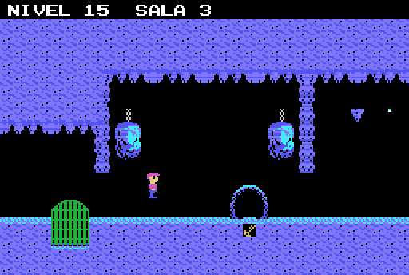

*Nivel 15, sala 3. Lleva: 2 bola de piedra, 1 estalactita, 1 puerta al nivel, 1 trasto, 1 jaula, 1 gotera.*

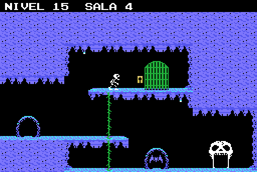

*Nivel 15, sala 4. Lleva: 2 gotera, 1 perseguidor, 1 puerta al nivel, 1 jaula, 1 murcielago.*

## Ronda 4 — niveles 16 a 20

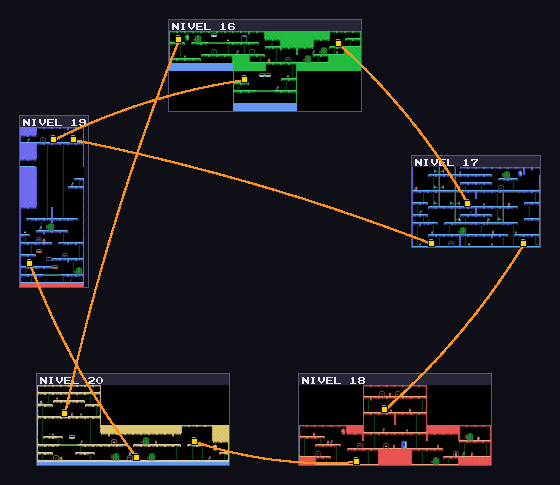

*Los cinco niveles de la ronda 4 y sus puertas de calavera. Cada nivel esta puesto con el reparto de salas que le da 0x52DB, y cada raya une DOS puertas que se emparejan de verdad: la puerta j del nivel A dice (B, k) y la puerta k del nivel B dice (A, j). Las 64 del cartucho emparejan asi, y ninguna sale de su ronda. Dos cosas de este dibujo NO salen de la ROM, y por eso se dicen: el sitio de cada nivel en el anillo -de los doce ordenes posibles se elige el que menos cruces deja- y la comba de las curvas, que separa las parejas de niveles unidas por DOS puertas.*

### Nivel 16

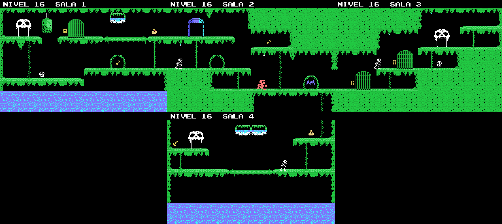

*Las cuatro salas del nivel 16, puestas donde el cartucho las pone: 2x3, `1- / 24 / 3-`. El reparto sale del nibble alto de 0x52DB, que es columna por cuatro mas fila.*

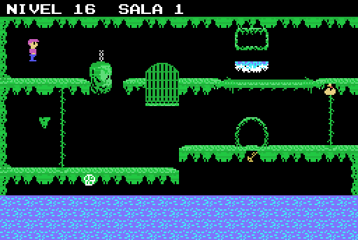

*Nivel 16, sala 1. Lleva: 1 estalactita, 1 puerta al nivel, 1 trasto, 1 jaula, 1 objeto, 1 agua, 1 bola de piedra, 1 calavera.*

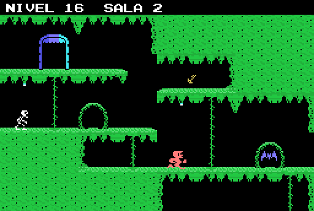

*Nivel 16, sala 2. Lleva: 2 estalactita, 2 perseguidor, 2 gotera, 1 trasto, 1 puerta, 1 murcielago.*

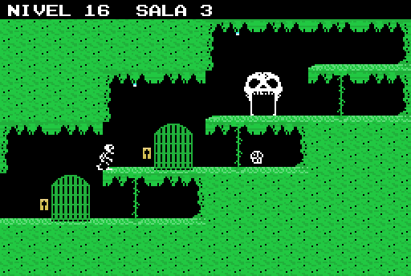

*Nivel 16, sala 3. Lleva: 2 jaula, 2 gotera, 1 perseguidor, 1 puerta al nivel, 1 calavera.*

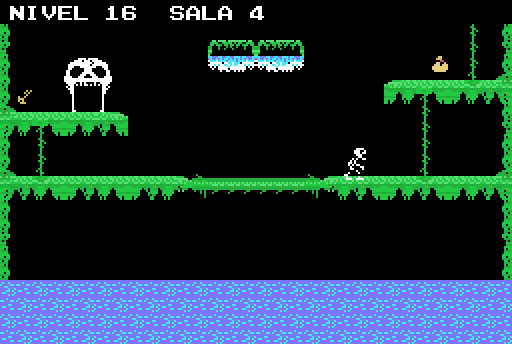

*Nivel 16, sala 4. Lleva: 2 agua, 1 perseguidor, 1 puerta al nivel, 1 trasto, 1 objeto.*

### Nivel 17

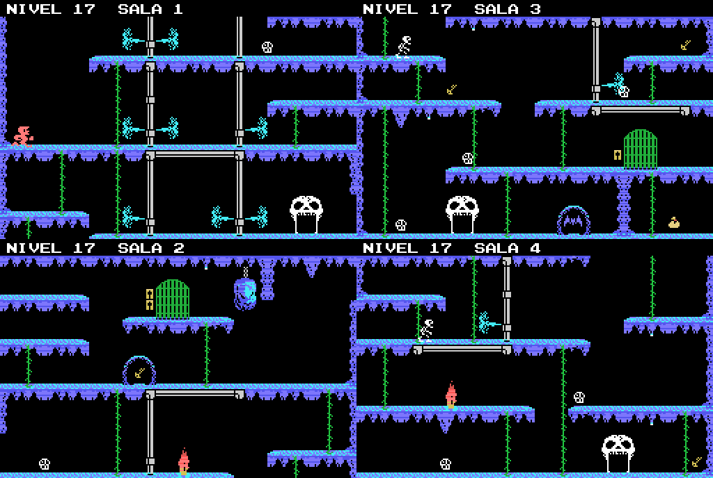

*Las cuatro salas del nivel 17, puestas donde el cartucho las pone: 2x2. El reparto sale del nibble alto de 0x52DB, que es columna por cuatro mas fila.*

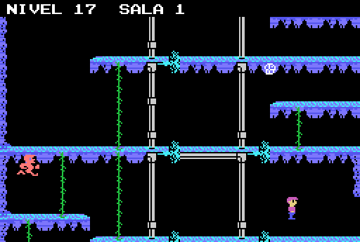

*Nivel 17, sala 1. Lleva: 8 chorro del tubo, 1 perseguidor, 1 puerta al nivel, 1 calavera.*

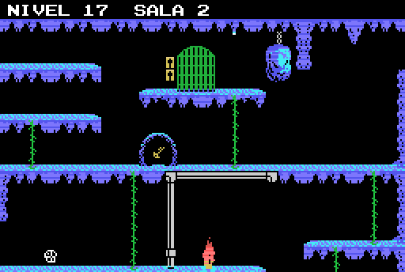

*Nivel 17, sala 2. Lleva: 1 estalactita, 1 trasto, 1 jaula, 1 bola de piedra, 1 llamarada, 1 gotera, 1 calavera.*

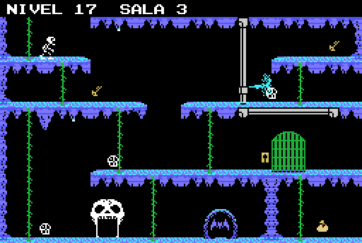

*Nivel 17, sala 3. Lleva: 6 columna que crece, 3 calavera, 2 trasto, 2 gotera, 1 estalactita, 1 perseguidor, 1 puerta al nivel, 1 jaula, 1 objeto, 1 chorro del tubo, 1 murcielago.*

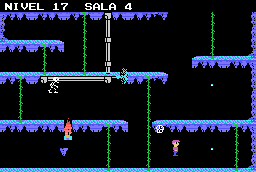

*Nivel 17, sala 4. Lleva: 2 gotera, 2 calavera, 1 estalactita, 1 perseguidor, 1 puerta al nivel, 1 trasto, 1 llamarada, 1 chorro del tubo.*

### Nivel 18

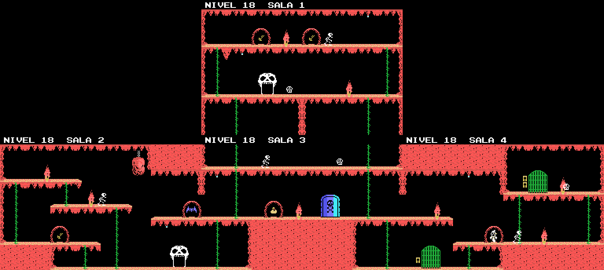

*Las cuatro salas del nivel 18, puestas donde el cartucho las pone: 2x3, `-2 / 13 / -4`. El reparto sale del nibble alto de 0x52DB, que es columna por cuatro mas fila.*

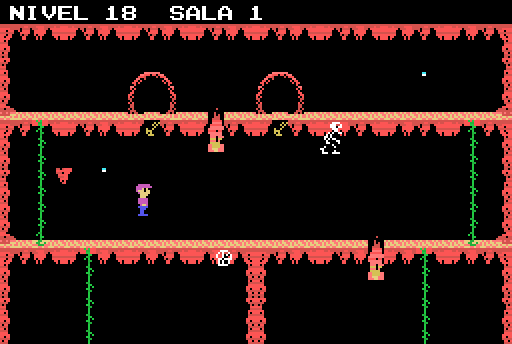

*Nivel 18, sala 1. Lleva: 2 trasto, 2 llamarada, 2 gotera, 1 estalactita, 1 perseguidor, 1 puerta al nivel, 1 calavera.*

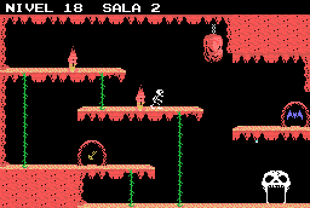

*Nivel 18, sala 2. Lleva: 2 llamarada, 1 perseguidor, 1 puerta al nivel, 1 trasto, 1 bola de piedra, 1 gotera, 1 murcielago.*

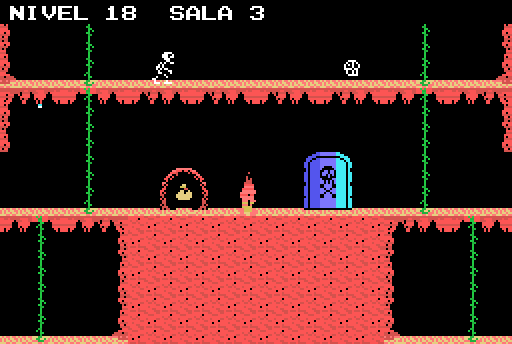

*Nivel 18, sala 3. Lleva: 1 perseguidor, 1 objeto, 1 puerta, 1 llamarada, 1 gotera, 1 calavera.*

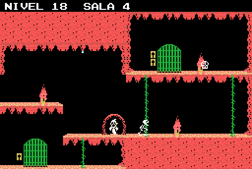

*Nivel 18, sala 4. Lleva: 3 llamarada, 2 jaula, 1 perseguidor, 1 trasto, 1 gotera, 1 calavera, 1 bicho de patas.*

### Nivel 19

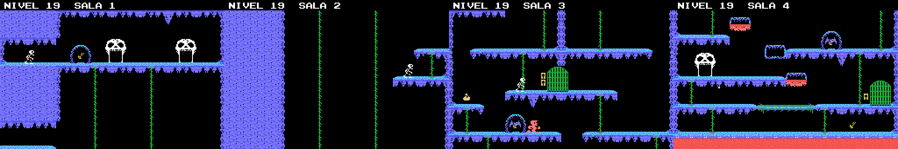

*Las cuatro salas del nivel 19, puestas donde el cartucho las pone: una fila de cuatro. El reparto sale del nibble alto de 0x52DB, que es columna por cuatro mas fila.*

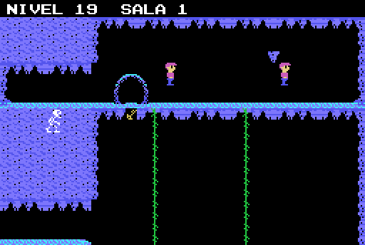

*Nivel 19, sala 1. Lleva: 2 puerta al nivel, 1 estalactita, 1 perseguidor, 1 trasto.*

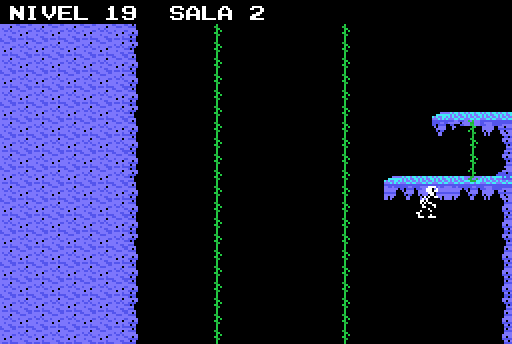

*Nivel 19, sala 2. Lleva: 1 perseguidor.*

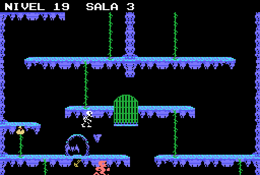

*Nivel 19, sala 3. Lleva: 2 perseguidor, 1 estalactita, 1 trasto, 1 jaula, 1 objeto, 1 murcielago.*

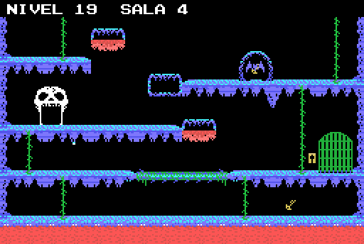

*Nivel 19, sala 4. Lleva: 2 trasto, 2 agua, 1 estalactita, 1 puerta al nivel, 1 jaula, 1 gotera, 1 murcielago.*

### Nivel 20

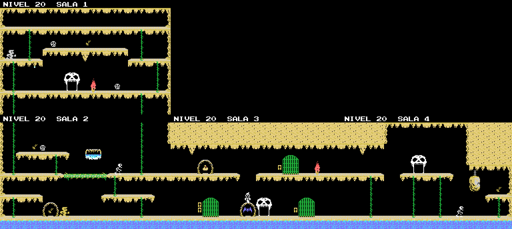

*Las cuatro salas del nivel 20, puestas donde el cartucho las pone: 2x3, `12 / -3 / -4`. El reparto sale del nibble alto de 0x52DB, que es columna por cuatro mas fila.*

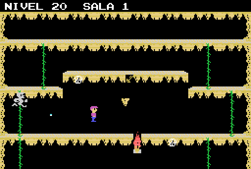

*Nivel 20, sala 1. Lleva: 2 calavera, 1 estalactita, 1 perseguidor, 1 puerta al nivel, 1 trasto, 1 llamarada, 1 gotera.*

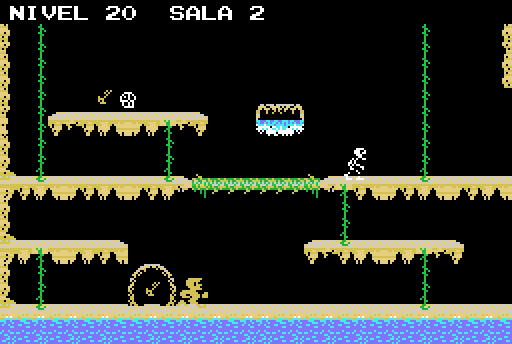

*Nivel 20, sala 2. Lleva: 2 perseguidor, 2 trasto, 1 agua, 1 calavera.*

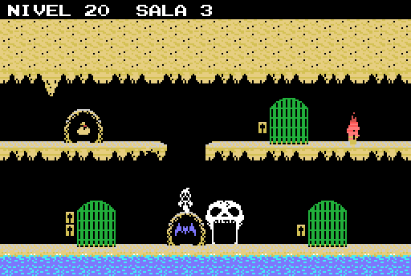

*Nivel 20, sala 3. Lleva: 3 jaula, 1 estalactita, 1 puerta al nivel, 1 objeto, 1 llamarada, 1 murcielago, 1 bicho de patas.*

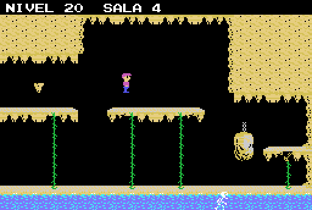

*Nivel 20, sala 4. Lleva: 1 estalactita, 1 perseguidor, 1 puerta al nivel, 1 trasto, 1 bola de piedra.*

## Ronda 5 — niveles 21 a 25

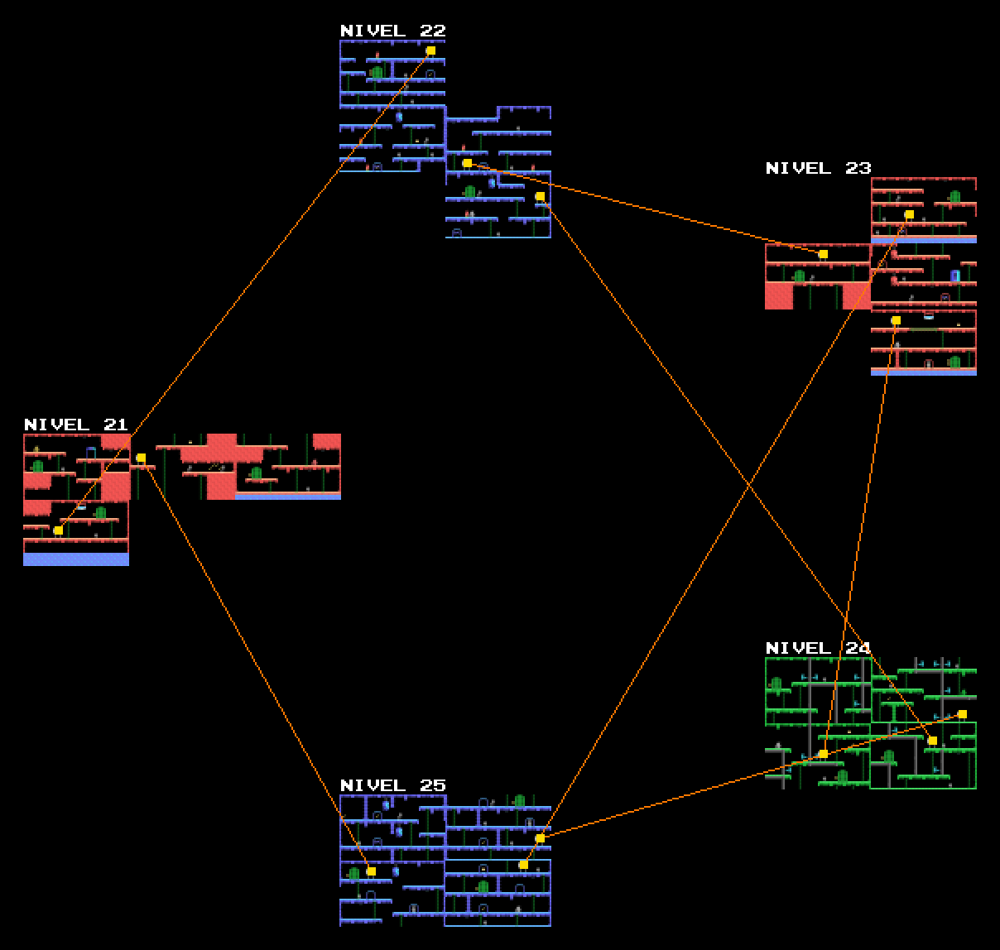

*Los cinco niveles de la ronda 5 y sus puertas de calavera. Cada nivel esta puesto con el reparto de salas que le da 0x52DB, y cada raya une DOS puertas que se emparejan de verdad: la puerta j del nivel A dice (B, k) y la puerta k del nivel B dice (A, j). Las 64 del cartucho emparejan asi, y ninguna sale de su ronda. Dos cosas de este dibujo NO salen de la ROM, y por eso se dicen: el sitio de cada nivel en el anillo -de los doce ordenes posibles se elige el que menos cruces deja- y la comba de las curvas, que separa las parejas de niveles unidas por DOS puertas.*

### Nivel 21

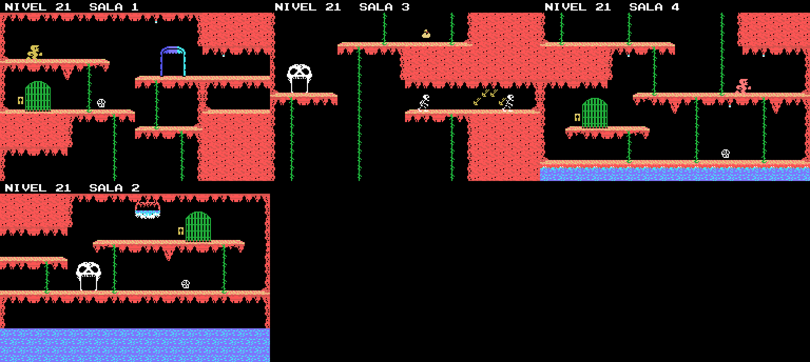

*Las cuatro salas del nivel 21, puestas donde el cartucho las pone: 3x2, `134 / 2--`. El reparto sale del nibble alto de 0x52DB, que es columna por cuatro mas fila.*

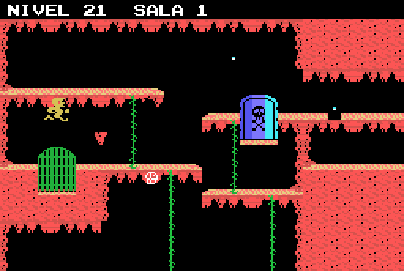

*Nivel 21, sala 1. Lleva: 2 gotera, 1 estalactita, 1 perseguidor, 1 jaula, 1 puerta, 1 calavera.*

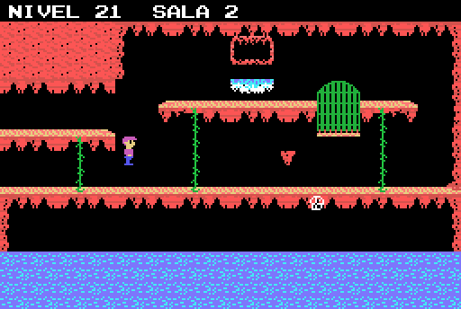

*Nivel 21, sala 2. Lleva: 1 estalactita, 1 puerta al nivel, 1 jaula, 1 agua, 1 calavera.*

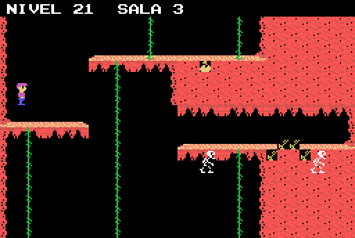

*Nivel 21, sala 3. Lleva: 4 trasto, 2 perseguidor, 1 puerta al nivel, 1 objeto.*

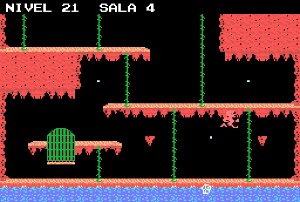

*Nivel 21, sala 4. Lleva: 3 gotera, 2 estalactita, 1 perseguidor, 1 jaula, 1 calavera.*

### Nivel 22

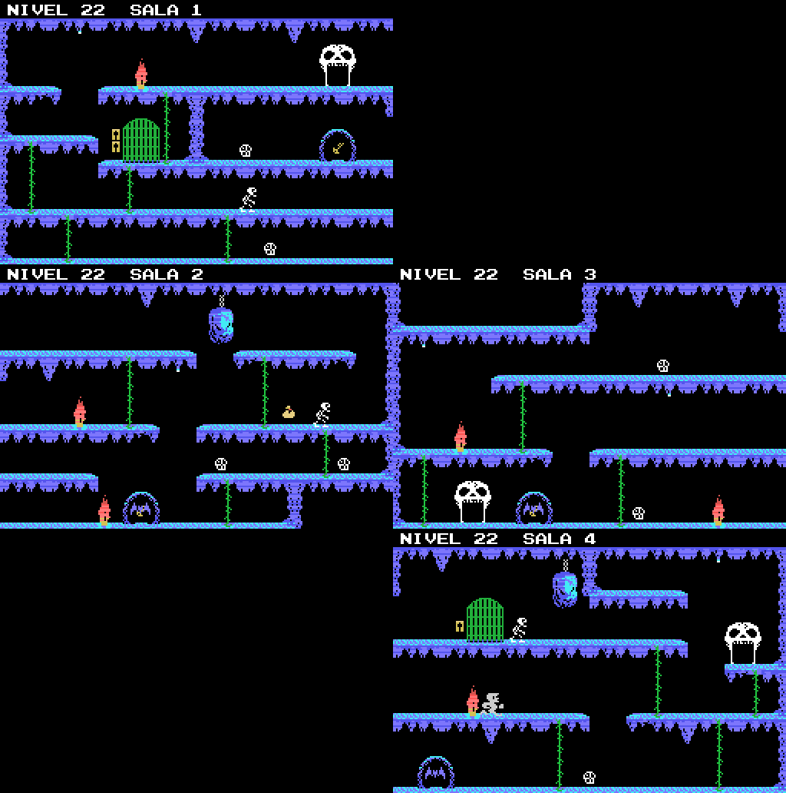

*Las cuatro salas del nivel 22, puestas donde el cartucho las pone: 2x3, `1- / 23 / -4`. El reparto sale del nibble alto de 0x52DB, que es columna por cuatro mas fila.*

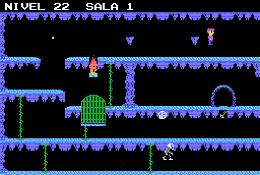

*Nivel 22, sala 1. Lleva: 2 estalactita, 2 calavera, 1 perseguidor, 1 puerta al nivel, 1 trasto, 1 jaula, 1 llamarada, 1 gotera.*

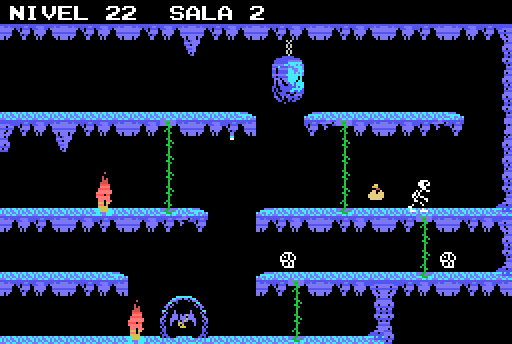

*Nivel 22, sala 2. Lleva: 2 estalactita, 2 llamarada, 2 calavera, 1 perseguidor, 1 trasto, 1 objeto, 1 bola de piedra, 1 gotera, 1 murcielago.*

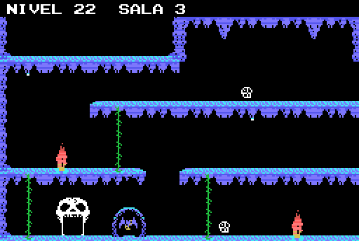

*Nivel 22, sala 3. Lleva: 2 estalactita, 2 llamarada, 2 gotera, 2 calavera, 1 puerta al nivel, 1 trasto, 1 murcielago.*

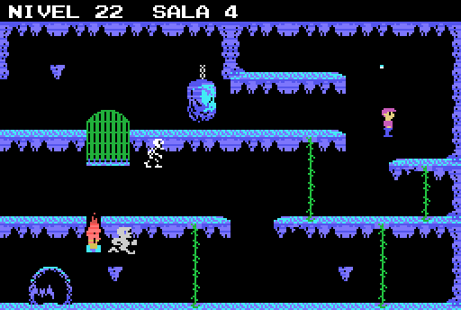

*Nivel 22, sala 4. Lleva: 3 estalactita, 2 perseguidor, 1 puerta al nivel, 1 jaula, 1 bola de piedra, 1 llamarada, 1 gotera, 1 calavera, 1 murcielago.*

### Nivel 23

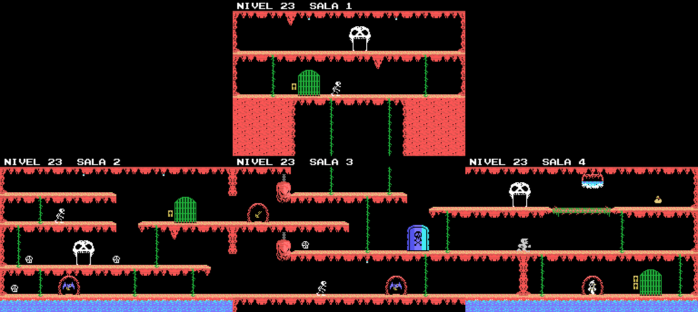

*Las cuatro salas del nivel 23, puestas donde el cartucho las pone: 2x3, `-2 / 13 / -4`. El reparto sale del nibble alto de 0x52DB, que es columna por cuatro mas fila.*

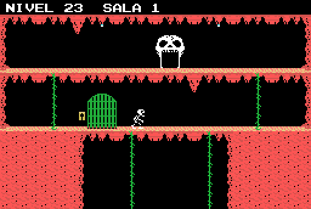

*Nivel 23, sala 1. Lleva: 2 estalactita, 2 gotera, 1 perseguidor, 1 puerta al nivel, 1 jaula.*

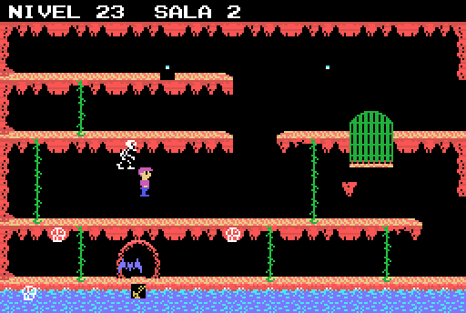

*Nivel 23, sala 2. Lleva: 3 calavera, 2 gotera, 1 estalactita, 1 perseguidor, 1 puerta al nivel, 1 trasto, 1 jaula, 1 murcielago.*

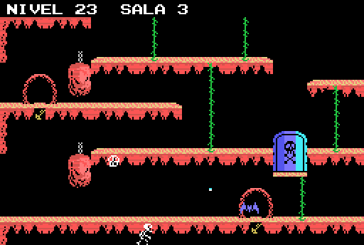

*Nivel 23, sala 3. Lleva: 2 trasto, 2 bola de piedra, 1 perseguidor, 1 puerta, 1 gotera, 1 calavera, 1 murcielago.*

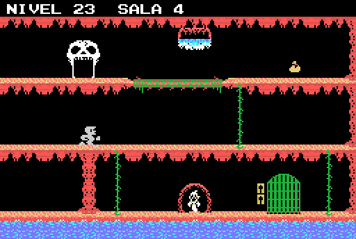

*Nivel 23, sala 4. Lleva: 1 perseguidor, 1 puerta al nivel, 1 trasto, 1 jaula, 1 objeto, 1 agua, 1 bicho de patas.*

### Nivel 24

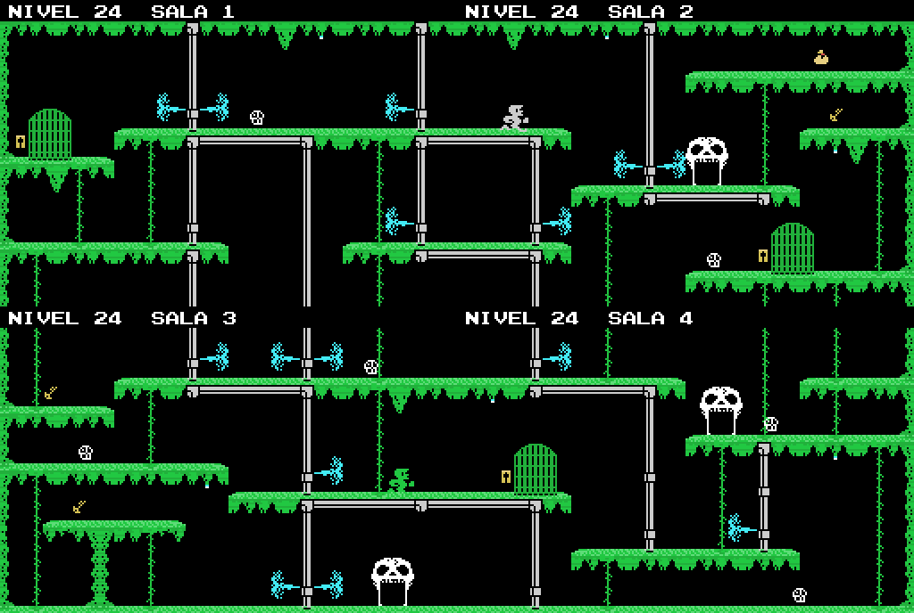

*Las cuatro salas del nivel 24, puestas donde el cartucho las pone: 2x2. El reparto sale del nibble alto de 0x52DB, que es columna por cuatro mas fila.*

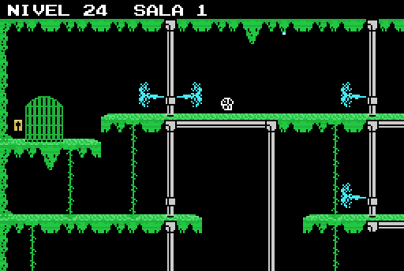

*Nivel 24, sala 1. Lleva: 4 chorro del tubo, 2 estalactita, 1 jaula, 1 gotera, 1 calavera.*

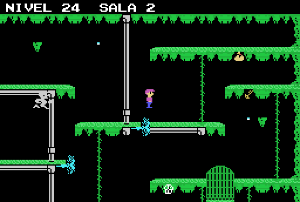

*Nivel 24, sala 2. Lleva: 3 chorro del tubo, 2 estalactita, 2 gotera, 1 perseguidor, 1 puerta al nivel, 1 trasto, 1 jaula, 1 objeto, 1 calavera.*

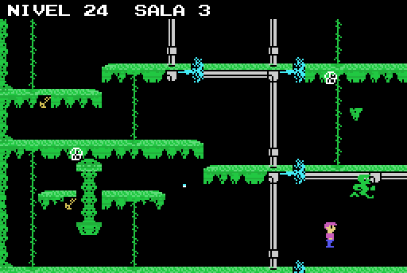

*Nivel 24, sala 3. Lleva: 6 columna que crece, 6 chorro del tubo, 2 trasto, 2 calavera, 1 estalactita, 1 perseguidor, 1 puerta al nivel, 1 gotera.*

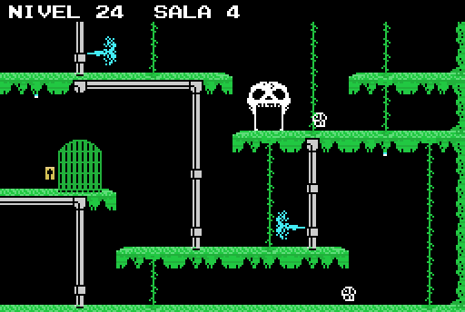

*Nivel 24, sala 4. Lleva: 2 chorro del tubo, 2 gotera, 2 calavera, 1 puerta al nivel, 1 jaula.*

### Nivel 25

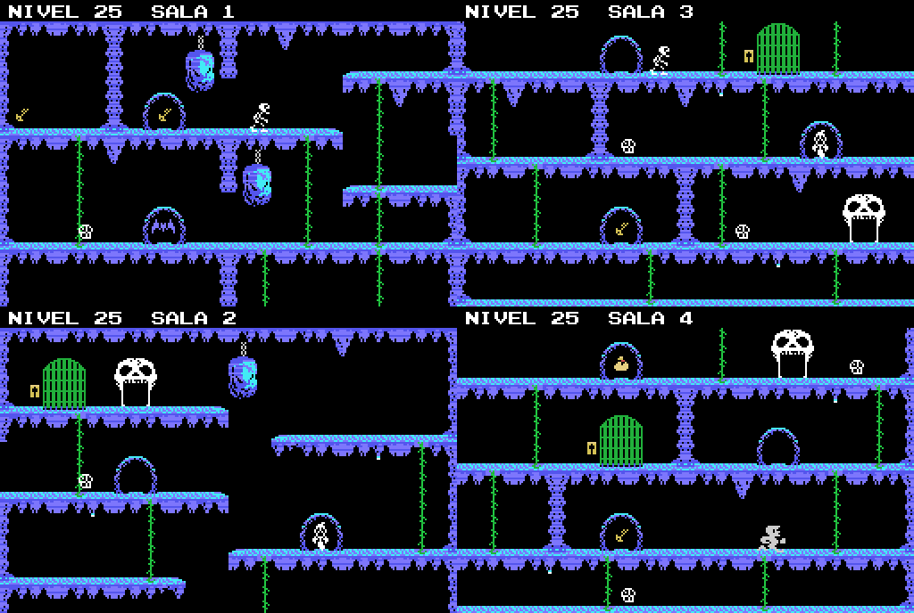

*Las cuatro salas del nivel 25, puestas donde el cartucho las pone: 2x2. El reparto sale del nibble alto de 0x52DB, que es columna por cuatro mas fila.*

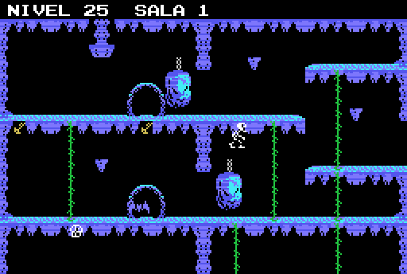

*Nivel 25, sala 1. Lleva: 8 columna que crece, 3 estalactita, 2 trasto, 2 bola de piedra, 1 perseguidor, 1 calavera, 1 murcielago.*

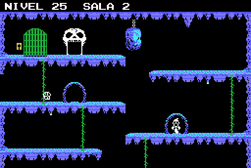

*Nivel 25, sala 2. Lleva: 2 gotera, 1 estalactita, 1 puerta al nivel, 1 jaula, 1 bola de piedra, 1 calavera, 1 bicho de patas.*

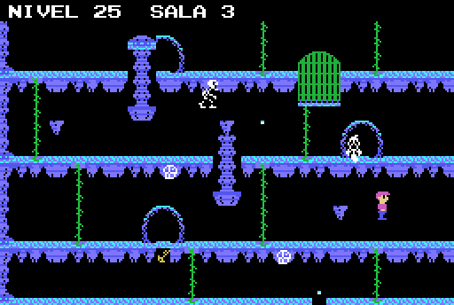

*Nivel 25, sala 3. Lleva: 12 columna que crece, 3 estalactita, 2 gotera, 2 calavera, 1 perseguidor, 1 puerta al nivel, 1 trasto, 1 jaula, 1 bicho de patas.*

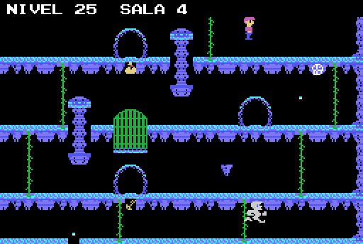

*Nivel 25, sala 4. Lleva: 12 columna que crece, 2 gotera, 2 calavera, 1 estalactita, 1 perseguidor, 1 puerta al nivel, 1 trasto, 1 jaula, 1 objeto.*

